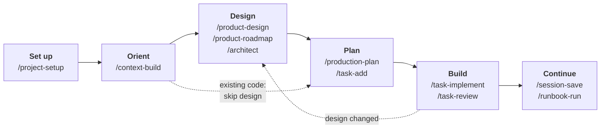
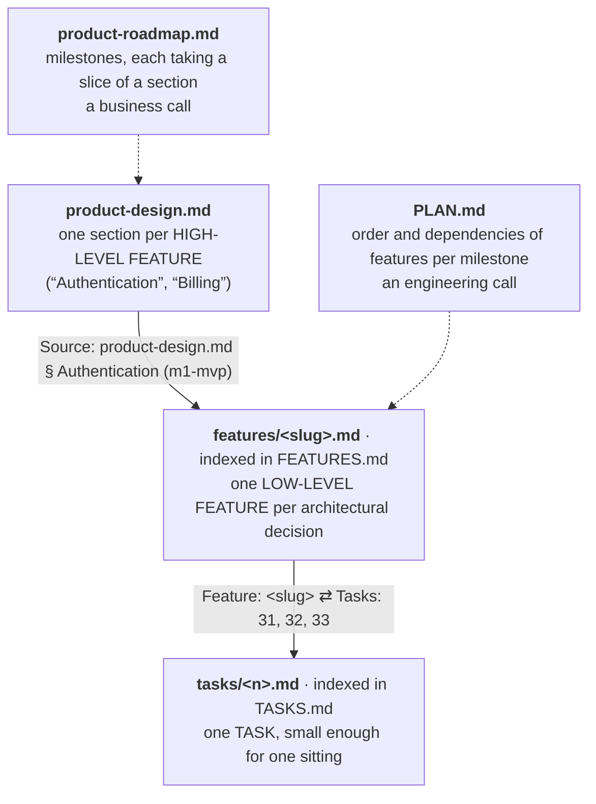
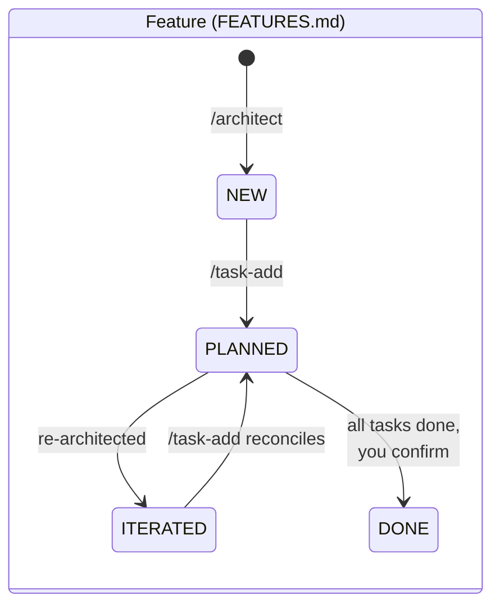
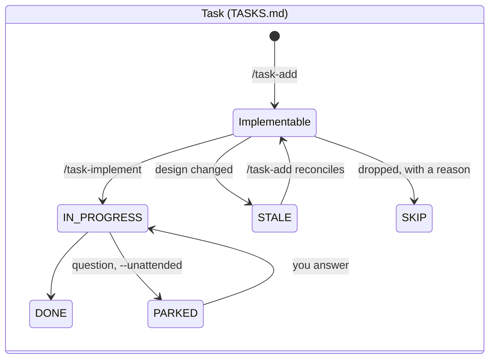

<div align="center">

# chosko-llm

**An opinionated, document-driven workflow for building software with Claude Code**,
and the CLI that installs it anywhere.

[](LICENSE)
[](https://claude.com/claude-code)
[](#the-cli)

### Keep your project's vision

Claude Code is very good at the next step but **forgetful** about everything before it.
This workflow allows Claude to pick up any stage cold **without drifting away from the big picture**.
[Read how →](#keep-the-vision)

### Optimize token usage

As your **project grows bigger**, Claude becomes **token-hungry** and even small tasks drain your subscription quickly.
chosko-llm orients Claude within your codebase so that **reads are constrained** to what really matters.
[Read how →](#spend-fewer-tokens)

### Reduce human-in-the-loop bottlenecks

Claude sessions require your presence, but **you mostly wait in chat** while the agent works. Then the roles switch in an infinite **hiccup**.
chosko-llm promotes **deep-focused design and planning sessions** to prepare big batches of work for a later moment.
[Read how →](#plan-once-build-later)

### Make it work overnight

Design, planning and implementation all **draw tokens from the same 5h pool**. Use **your day to design and plan**, and **Claude's night to implement**. 
chosko-llm allows for totally **unmanned cloud sessions** that you can run and check from your phone while **your PC is off**.
When unexpected problems arise, unmanned sessions will **park problematic tasks** and go on with the rest of the work. You'll catch up when you have time.
[Read how →](#run-it-overnight)


</div>


## Quick start

1. **Install the CLI.** It clones a managed copy to `~/.chosko-llm` and puts
   a small proxy at `~/bin/chosko-llm`.

   ```sh
   curl -fsSL https://raw.githubusercontent.com/Chosko/chosko-llm/master/install.sh | bash
   ```

2. **Add the features** — all of them, or only the ones you want.

   ```sh
   chosko-llm add --all
   chosko-llm add task-add task-implement context-build   # or pick
   ```

3. **Use them inside Claude Code**, in any project.

   ```text
   /project-setup                      # CLAUDE.md, backlog, domain and context layers, in one pass
   /task-add "add a health endpoint"   # plan one task with you, criteria included
   /task-implement next                # build it, test-first, as one commit
   ```

> [!NOTE]
> On Windows, run the installer from Git Bash.

`chosko-llm upgrade && chosko-llm update --all` picks up new versions.

## How it works

Claude Code is good at the next step and forgetful about everything before
it. chosko-llm gives each project three small sets of documents, each
answering one question, so any session can pick up any stage cold.
`CLAUDE.md` points at all three; every session starts by reading an index
instead of the tree.

| | Navigation | Knowledge | Work |
| --- | --- | --- | --- |
| **Answers** | *Where is what?* | *What is this, and why?* | *What's done, what's next?* |
| **Lives in** | `.claude/context/` | `.claude/domain/` | `FEATURES.md`, `PLAN.md`, `TASKS.md`, runbooks, sessions |
| **Written by** | `/context-build`, `/context-update`, from the code | the design stage, by interviewing you | the planning and build commands, as work moves |
| **Changes when** | the code changes | the product changes | work moves |
| **Holds status?** | never — it describes, it never decides | never — it records intent | yes — the only layer that does |

<details>
<summary><b>What a fully set-up project looks like</b> — every entry is optional and appears only when its stage has run</summary>

```
CLAUDE.md                        # entry point every session reads first: pointers to the
                                 # layers below, testing policy, VCS notes
.claude/
├── context/                     # NAVIGATION — where things are in the code
│   ├── INDEX.md                 #   one row per context file; `Layout: flat|nested`
│   └── <area>.md                #   six-section summary of one source area
├── domain/                      # KNOWLEDGE — what the product is and why
│   ├── INDEX.md                 #   index of the documents below
│   ├── product-design.md        #   what it is, for whom, key flows, decisions, high-level features
│   ├── technical-direction.md   #   stack, topology, data, hosting for the whole product
│   ├── business-model.md        #   optional
│   ├── design-process.md        #   /product-design's resume state
│   ├── product-roadmap.md       #   ordered milestones + the scope slices they take on
│   └── features/<slug>.md       #   one low-level feature document per architected feature
├── FEATURES.md                  # WORK — index of architected features: status, source, tasks
├── PLAN.md                      #   which feature in which milestone, in what order, after what
├── TASKS.md                     #   index of tasks: status, target, files, preconditions, feature
├── tasks/<n>.md                 #   one task body each: goal, acceptance criteria, hints
├── external/                    #   run-affected-tests.sh, run-full-tests.sh — the test dispatch
├── RUNBOOKS.md + runbooks/      #   ordered prompt lists for work not yet done
├── sessions/                    #   handoff snapshots of work in flight
└── hooks/ + settings.json       #   local hooks (e.g. remote-session-protocol), committed
```

Nothing lives in your home directory except the installed features themselves.

</details>

### What a run looks like

An abridged example of the build loop. The task is planned once, with you;
the implementation needs no further input.

```text
> /task-add "add a health endpoint"
  … reads the routing code, asks: auth-exempt? which checks? response shape?
  … shows the task body with acceptance criteria — you approve
  Task 14 added: [MISSING] Add a /health endpoint — committed and pushed

> /task-implement next --review
  Task 14 — tests written and failing → implemented → tests green
  Review round 1: 1 finding (IMPORTANT) — fixed
  Task 14 [DONE] — one commit, pushed

  For the record
  none

  Follow-ups
  1. /context-update — the new route module isn't in the context layer yet
```

## Pick your path

| You have | Start with | Then |
| --- | --- | --- |
| **An idea, no code** | `/project-setup` → `/product-design` | `/architect` per feature, `/task-add feature=<slug>`, `/task-implement` |
| **An existing codebase** | `/project-setup` with the context layer | `/architect` (it reads your code), or skip design and use `/task-add` directly |
| **Just a backlog** | `/task-setup` | `/task-add "<description>"`, `/task-implement next` |

## The workflow



Every stage is optional, and each writes its output into the repo:

| Stage | You run | It writes |
| --- | --- | --- |
| 1. Set up | `/project-setup`, `/task-setup`, `/domain-setup` | `CLAUDE.md`, `.claude/TASKS.md`, `.claude/domain/`, `.claude/FEATURES.md` |
| 2. Orient | `/context-build`, `/context-update`, `/context-convert` | `.claude/context/` |
| 3. Design | `/product-design`, `/product-roadmap`, `/architect` | design documents, one feature document per architected feature |
| 4. Plan | `/production-plan`, `/task-add`, `/pipeline-revise` | `.claude/PLAN.md`, task bodies + `TASKS.md` entries |
| 5. Build | `/task-implement`, `/task-review`, `/task-iterate` | code, one reviewed commit per task |
| 6. Continue | `/runbook-*`, `/session-save`, `/session-resume`, `/follow-ups` | `.claude/runbooks/`, `.claude/sessions/` |
| 7. Maintain | `/refactor-codebase`, `/refactor-tests`, `/doc-consolidate` | a cleaner codebase and rules documents, tests green throughout |

**Commits.** Commands that write project work — design, planning, tasks,
builds, runbooks, handoffs — commit and push by default and take
`--no-commit` / `--no-push`. Setup and maintenance commands leave their
output uncommitted for review and take `--commit`. Read-only commands write
nothing. The tables below say which is which.

### From product to task

The design and work documents form one chain, from the broadest intent to
the smallest unit of work. Each link is a named field, so the chain can be
walked in either direction by reading files.



The roadmap and the plan hold no features or tasks of their own; they
*arrange* the level they sit beside. Both are optional. Without them,
`/architect` designs whole sections and `PLAN.md` is simply absent.

### Statuses

Only the work documents carry status, and each level means something
different by it.





*Implementable* is any of `[MISSING]`, `[STUBBED]`, `[INCORRECT]` and
`[PARTIAL]`. Milestones in `PLAN.md` move `[PLANNED]` → `[ACTIVE]` →
`[SHIPPED]`, at most one active, and a shipped milestone never reopens.
`[ITERATED]` is the one state that demands action;
[`/pipeline-check`](#4-plan-the-work) finds every one still waiting.

## 1. Set up a project

One wizard, or two narrower commands you can run alone. All three leave
their output uncommitted for review (`--commit` to commit).

| Command | What it does |
| --- | --- |
| `/project-setup` | Seeds `CLAUDE.md` from whatever you paste, adds an optional `AGENTS.md` pointer, a VCS section for non-git projects, and offers the setups below. Asks everything up front, confirms once. |
| `/task-setup` | Creates the backlog and the project's test-dispatch scripts, so `/task-implement` never guesses the test command. |
| `/domain-setup` | Scaffolds `.claude/domain/` and `FEATURES.md`, then stops. Design documents come from the design stage. |

[Details →](docs/reference.md#1-setting-up-a-project)

## 2. Keep Claude oriented

The context layer lets a session open only the files it needs.

| Command | What it does | Commits? |
| --- | --- | --- |
| `/context-build` | Builds the layer once: flat by default; `nested` for repos where one index is itself an expensive read. | `--commit` |
| `/context-update` | Refreshes only what the latest commits touched. Run it after landing code. | yes |
| `/context-convert` | Moves a layer between flat and nested without rebuilding it, plan first. | `--commit` |

[Details →](docs/reference.md#2-keeping-claude-oriented)

## 3. Design the product

The most opinionated stage. Each command is resumable, because its state
lives in the document it writes: run it again weeks later and it picks up
where it stopped.

| Command | What it does | Commits? |
| --- | --- | --- |
| `/product-design` | Works out the product with you: what it is, for whom, key flows, decisions, high-level features, and the technical direction. On existing code it opens with "here's what I see you've built — is this still the intent?" | yes |
| `/product-roadmap` | Orders milestones, each with a goal, exit criteria and **scope slices** ("email and password only; no SSO"). No dates, no estimates: intent, not progress. | yes |
| `/architect` | Decides how one feature will be built — components, data, contracts; no code — as a feature document. One product feature often becomes several. | yes |

- **Designs change after tasks exist.** Re-run `/architect` on a planned
  feature and it marks the unfinished tasks `[STALE]` and the feature
  `[ITERATED]`; `/task-add feature=<slug>` then reconciles them. For a
  targeted change, `/architect amend` stales only the tasks the change
  touches. It refuses while a task it would stale is `[IN PROGRESS]`.
- **Hard calls get a council.** At a genuine fork, `/product-design` and
  `/architect` can hand the decision to `claude-council`, a vendored copy of
  [TorpedoD/claude-council](https://github.com/TorpedoD/claude-council): five
  thinking lenses, anonymous peer review and a verdict that keeps dissent.
  Optional, and needs `jq`; when it isn't installed the commands say nothing.

[Details →](docs/reference.md#3-designing-the-product)

## 4. Plan the work

`/task-add` is the heart of the workflow: spend the focus in planning, then
let the agent consume the tasks whenever it's convenient.

| Command | What it does | Commits? |
| --- | --- | --- |
| `/task-add` | Turns a description, or a feature document (`feature=<slug>`), into tasks. Investigates the code, asks every question the work needs, and writes acceptance criteria you approve. | yes |
| `/production-plan` | Orders features into milestones with dependency edges you confirm. The order *is* the priority; it refuses cycles and features scheduled before what they need. | yes |
| `/production-status` | Tells you the active milestone, what's ready, what's blocked and by what, and the one feature to build next. | read-only |
| `/pipeline-check` | Reports drift between the indexes — dangling links, cycles, stale work waiting — each finding with the one command that fixes it. | read-only |
| `/pipeline-revise` | Changes already-planned work — one wording fix or a dozen edits — through the command that owns each file. | one commit at the end |

- **Tasks land where they belong.** `--before <N>` / `--after <N>` insert a
  task mid-backlog with the precondition its position implies.
- **Some work needs hands.** When part of a task only a person can do — an
  editor step, a cloud console — `/task-add` records the checkpoints, and
  `/task-implement` pauses at each one and verifies the outcome.
- **Revisions are planned like anything else.** `/pipeline-revise` traces
  each change up to the feature and down to its tasks and runbook steps,
  shows every step as one numbered plan, and you reply by number. Nothing is
  deleted: a removed task becomes `[SKIP]` with a reason.

[Details →](docs/reference.md#4-planning-the-work)

## 5. Build and review

| Command | What it does | Commits? |
| --- | --- | --- |
| `/task-implement` | Builds a task end-to-end, test-first, as one commit. `next` takes the first task whose preconditions are met; `all` works through the backlog. | yes, per task |
| `/task-review` | Audits a diff against the task's acceptance criteria in a fresh context. Reports only findings it is confident in, each with a `file:line` and a concrete failure. | read-only |
| `/task-iterate` | Triages review findings: each is fixed, deferred or rejected, and the reason is written down. | yes |
| `/task-list` | Shows the backlog, grouped by milestone when a plan exists. | read-only |
| `/task-clean` | Archives finished tasks out of the backlog — moved, never deleted. | yes |

- **`--review`** runs a review round before each commit, sized to the diff;
  `--rounds N` loops it. Rejected findings carry into the next round, so the
  same finding can't simply be raised again.
- **A multi-task run** can hand each task to a fresh subagent, so later
  tasks don't inherit earlier ones' context. Stale tasks are skipped, never
  guessed at.
- **Every run ends with one report:** what deviated, *for the record*, then
  a numbered list of follow-ups. You reply by number.

### Unattended runs

By default a question about the work is put to you and the run waits. With
**`--unattended`**, the task that asked is **parked** instead: marked
`[PARKED]`, its question saved verbatim under a handle like `P1`, its work
kept on a `park/task-<N>` branch. The run goes on to the next task. You
answer whenever you're back — at the next launch, in chat, or after the
report — with a reply like `Unpark P1: Q1a, Q2b`, and the task resumes where
it stopped. `/runbook-run --unattended` parks runbook steps the same way.

[Details →](docs/reference.md#5-building-and-reviewing)

## 6. Work across sessions

A conversation ends, and its context ends with it. Four tools keep what
matters.

| For | Command | What it does |
| --- | --- | --- |
| Work not yet done | `/runbook-create` | Captures a list of follow-up prompts as a runbook, each written for a fresh agent that has none of this conversation. |
| | `/runbook-run` | Runs it one step at a time, each step in its own subagent, relaying questions to you and committing after every step. `--inline` runs the steps in your own session. |
| | `/runbook-list`, `/runbook-describe`, `/runbook-prune`, `/runbook-clean` | List, inspect and tidy runbooks. |
| Work about to be lost | `/follow-ups` | Lists what this conversation would lose if it ended now — or says `No follow-ups left`, and means it. |
| Work in flight | `/session-save` | Writes a handoff: what was tried and failed, what was left alone on purpose, half-finished files, the exact next step. |
| | `/session-resume` | Briefs a new session from the handoff, then **stops** — it takes no step of the plan itself. |
| Cloud sessions | `hook:remote-session-protocol` | Has Claude batch every open question into one numbered message instead of asking while nobody is at the keyboard. |

> [!IMPORTANT]
> The hook is local-only: install it with `--local` and commit it to the
> repository it governs.

[Details →](docs/reference.md#6-working-across-sessions)

## 7. Keep the codebase healthy

All three plan first, wait for your approval, and leave their work
uncommitted.

| Command | What it does |
| --- | --- |
| `/refactor-codebase` | Constants, duplication, oversized files, imports, naming — behaviour-preserving, phase by phase, halting on the first failing test. |
| `/refactor-tests` | Splits bloated test files, the suite green before and after each split. |
| `/doc-consolidate` | Rewrites a rules document so each rule is stated once, and has a fresh-context verifier list anything the rewrite lost. |

[Details →](docs/reference.md#7-keeping-the-codebase-healthy)

## 8. Extras

| Feature | What it does |
| --- | --- |
| `/unity-mcp-setup` + `unity-mcp-skill` | Wires a Unity project for MCP, so `/task-implement` can drive the editor itself. |
| `claude-md:git-commit-style` | Scannable commit messages, trailers only on big commits. |
| `claude-md:tool-usage-policy` | Built-in file tools over shell commands. |
| `claude-md:editing-discipline` | Rules documents that supersede instead of piling up. |
| `statusline:session-statusline` | Model, directory, branch, context usage, cost and rate limits in the status bar. Global-only. |

The `claude-md:*` features inject a managed section into `CLAUDE.md` —
your global one, or a project's with `--local`.
[Details →](docs/reference.md#8-editor-and-shell-extras)

### Skills that fire on their own

You never type these; Claude reaches for them when the conversation calls
for it, and each says one or two lines.

| Skill | Fires when |
| --- | --- |
| `pipeline-suggest` | You describe work in your own words — it names the pipeline command that fits. |
| `runbook-suggest` | A conversation produces a list of follow-ups worth keeping — it suggests `/runbook-create`. |
| `follow-ups-resolve` | You answer a follow-ups list ("do 1 and 3, I'll handle 4") — it confirms the plan with you, then carries it out. |

## The CLI

Small on purpose: a managed clone at `~/.chosko-llm/`, a proxy at
`~/bin/chosko-llm`, and plain file copies into `~/.claude/`. The filesystem
is the only state; there is no lockfile.

```sh
chosko-llm ls                     # every feature: installed vs available version
chosko-llm show <feature>         # description and flags; --diff --content previews an update
chosko-llm add <feature> ...      # install (pulls in anything it requires)
chosko-llm rm <feature>           # remove (refuses while something still requires it)
chosko-llm upgrade                # pull the latest source; prints the changelog for what moved
chosko-llm update --all           # re-copy every installed feature from that source
chosko-llm changelog --since 30d  # read the changelog from a version, date or duration
chosko-llm channel <branch>       # point the clone at a branch to try unmerged work
chosko-llm export [--archive]     # package a repo's Claude config for a Project or a chat
chosko-llm uninstall              # tear it all down, prompting at each step
```

- **Five feature kinds.** Commands and skills copy into `~/.claude/`;
  claude-md snippets inject a managed section into `CLAUDE.md`; statusline
  scripts are global-only; hooks are local-only. A bare name matches any
  kind; `kind:<name>` disambiguates.
- **Per-repository installs.** Every verb takes `--local` to target
  `<cwd>/.claude`, so a cloud agent that can't run the installer still gets
  the commands the project needs.
- **Staying current.** The first command you run each day quietly runs
  `upgrade`; `update --all` stays an explicit step. `upgrade
  --disable-auto` opts out.

[Details →](docs/reference.md#9-the-cli)

## How it compares

Several projects give Claude Code a structured workflow. Where chosko-llm
differs:

| | chosko-llm | [Spec Kit](https://github.com/github/spec-kit) | [CCPM](https://github.com/automazeio/ccpm) | [BMAD Method](https://github.com/bmad-code-org/BMAD-METHOD) | [Task Master](https://github.com/eyaltoledano/claude-task-master) |
| --- | --- | --- | --- | --- | --- |
| **Center of gravity** | design → tasks → reviewed commits, kept in repo documents | specs per change | PRDs → epics → GitHub issues | agent personas across an agile lifecycle | a task list parsed from a PRD |
| **Separate navigation layer for the code** | yes | — | — | — | — |
| **Design changes re-plan only affected tasks** | yes | — | — | — | — |
| **Unattended runs that park on a question** | yes | — | — | — | — |
| **Where the work is tracked** | Markdown in the repo | Markdown in the repo | GitHub Issues | Markdown in the repo | JSON in the repo |
| **Runtime** | bash + git | Python (uv) | bash + `gh` | Node | Node |

This comparison reflects each project's README at the time of writing; a
dash means the README doesn't describe it.

## Contributing

Working on chosko-llm itself — developer install, authoring a feature,
versioning rules — is covered in [CONTRIBUTING.md](CONTRIBUTING.md).

## License

[MIT](LICENSE). Copies must keep the copyright notice. The vendored
`claude-council` skill is © TorpedoD, MIT-licensed, with its own
[LICENSE](skills/claude-council/LICENSE).
